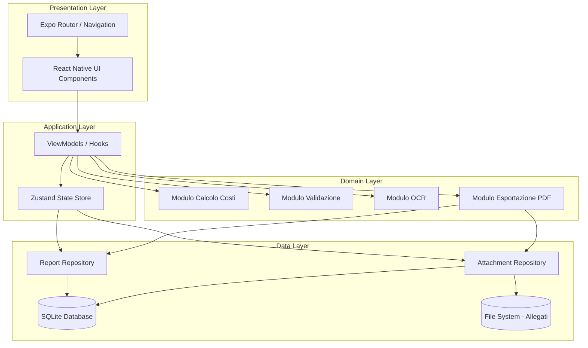
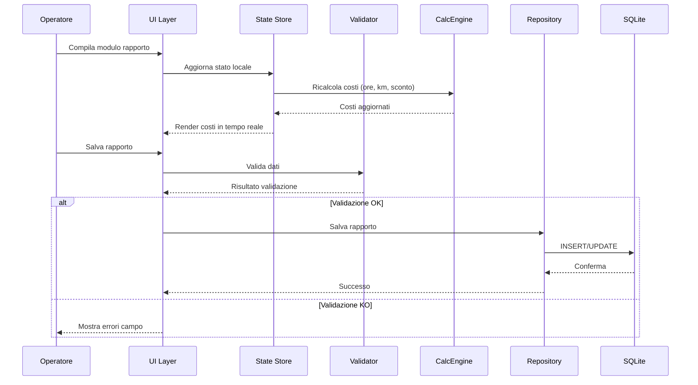

# Design Document

## Overview

Applicazione mobile offline-first per la registrazione e condivisione di rapporti di assistenza tecnica. L'app è pensata per operatori sul campo che necessitano di compilare rapporti di intervento senza connessione internet, con calcolo automatico dei costi e generazione PDF per la condivisione.

### Scelte Tecnologiche

| Componente | Tecnologia | Motivazione |
|---|---|---|
| Framework | React Native + Expo | Cross-platform iOS/Android, ecosistema maturo, accesso a moduli nativi |
| Linguaggio | TypeScript | Type safety, autocompletamento, riduzione bug runtime |
| Database locale | expo-sqlite con Drizzle ORM | Persistenza offline, query tipizzate, migrazioni gestite |
| Stato applicazione | Zustand | Leggero, TypeScript-first, nessun boilerplate |
| Navigazione | expo-router | File-based routing, deep linking integrato |
| PDF | react-native-html-to-pdf | Generazione PDF da template HTML, supporto immagini inline |
| Condivisione | expo-sharing / react-native-share | Menu condivisione nativo iOS/Android |
| OCR | @react-native-ml-kit/text-recognition | Riconoscimento testo on-device (Google ML Kit), nessuna rete richiesta |
| Fotocamera | expo-image-picker + expo-camera | Scatto foto e selezione da galleria |
| File system | expo-file-system | Gestione file allegati nel filesystem locale |
| UI | React Native Paper (Material Design 3) | Componenti accessibili, tema personalizzabile |

### Principi Architetturali

- **Offline-first**: Tutti i dati risiedono localmente. Nessuna funzionalità dipende dalla rete.
- **Separazione responsabilità**: Moduli indipendenti per calcolo, validazione, OCR, esportazione.
- **Type safety end-to-end**: Schema database → modelli TypeScript → componenti UI.
- **Fail-safe**: Salvataggio automatico bozze, retry su errori, nessuna perdita dati.

## Architecture

### Architettura a Livelli



### Flusso Dati Principale



## Components and Interfaces

### 1. Modulo Calcolo Costi (`CostCalculationEngine`)

Motore di calcolo puro (senza side-effect) che computa i costi dell'intervento.

```typescript
interface CostInput {
  hours: number;        // 0.25 - 24.00, incrementi 0.25
  kilometers: number;   // 0 - 9999999
  discountPercent: number; // 0 - 100
}

interface CostBreakdown {
  hourlyTotal: number;      // hours × 60€
  kilometerTotal: number;   // km × 0.90€
  subtotal: number;         // hourlyTotal + kilometerTotal
  discountAmount: number;   // subtotal × (discount/100)
  discountedSubtotal: number; // subtotal - discountAmount
  vatAmount: number;        // discountedSubtotal × 0.22
  grandTotal: number;       // discountedSubtotal + vatAmount
}

interface CostCalculationEngine {
  calculate(input: CostInput): CostBreakdown;
}
```

**Regole di arrotondamento**: Ogni risultato intermedio viene arrotondato a 2 decimali (half-up rounding).

**Costanti**:
- `HOURLY_RATE = 60` (€/h)
- `KM_RATE = 0.90` (€/km)
- `VAT_RATE = 0.22` (22%)

### 2. Modulo Validazione (`ValidationModule`)

Validatore che verifica la correttezza dei dati inseriti prima del salvataggio.

```typescript
interface ValidationError {
  field: string;
  message: string;
  type: 'required' | 'format' | 'range';
}

interface ValidationResult {
  isValid: boolean;
  errors: ValidationError[];
}

interface ValidationModule {
  validateReport(report: ReportFormData): ValidationResult;
  validateField(field: string, value: unknown): ValidationError | null;
  validateVatNumber(vatNumber: string): boolean;
  validateHours(hours: number): boolean;
  validateKilometers(km: number): boolean;
  validateDiscount(discount: number): boolean;
}
```

### 3. Modulo OCR (`OcrModule`)

Riconoscimento ottico numeri di serie da immagini, utilizzando Google ML Kit on-device.

```typescript
interface OcrResult {
  success: boolean;
  serialNumber: string | null;  // formato "1ZZ..."
  confidence: number;           // 0.0 - 1.0
  rawText: string;              // testo grezzo riconosciuto
}

interface OcrModule {
  recognizeSerialNumber(imageUri: string): Promise<OcrResult>;
}
```

**Logica di estrazione**: Il modulo esegue il riconoscimento testo completo sull'immagine, poi filtra i blocchi di testo cercando pattern che iniziano con "1ZZ" tramite regex `/1ZZ[A-Z0-9]+/`.

### 4. Modulo Esportazione PDF (`PdfExportModule`)

Genera un file PDF dal rapporto e attiva la condivisione nativa.

```typescript
interface PdfExportResult {
  success: boolean;
  filePath: string | null;
  error: string | null;
}

interface PdfExportModule {
  generatePdf(report: Report, attachments: Attachment[]): Promise<PdfExportResult>;
  sharePdf(filePath: string): Promise<void>;
}
```

**Struttura PDF**: Il PDF è organizzato in sezioni (Dati Cliente, Dettagli Intervento, Costi, Allegati) con etichette leggibili. Include uno spazio dedicato per timbro/firma. Le foto vengono incluse inline, i video come frame di anteprima con descrizione.

### 5. Report Repository (`ReportRepository`)

Interfaccia di accesso dati per i rapporti.

```typescript
interface ReportRepository {
  create(report: ReportFormData): Promise<Report>;
  update(id: string, report: Partial<ReportFormData>): Promise<Report>;
  delete(id: string): Promise<void>;
  getById(id: string): Promise<Report | null>;
  getAll(): Promise<Report[]>;
  search(query: SearchQuery): Promise<Report[]>;
  saveDraft(report: ReportFormData): Promise<Report>;
  getStorageInfo(): Promise<{ usedReports: number; maxReports: number }>;
}

interface SearchQuery {
  text?: string;          // ricerca su ragione sociale o numero serie
  dateFrom?: string;
  dateTo?: string;
  status?: 'draft' | 'completed';
}
```

### 6. Attachment Repository (`AttachmentRepository`)

Gestione allegati multimediali con storage su filesystem.

```typescript
interface AttachmentRepository {
  add(reportId: string, attachment: AttachmentInput): Promise<Attachment>;
  remove(attachmentId: string): Promise<void>;
  getByReportId(reportId: string): Promise<Attachment[]>;
  getCount(reportId: string): Promise<number>;
}

interface AttachmentInput {
  uri: string;
  type: 'image' | 'video';
  description?: string;
  mimeType: string;
  fileSize: number;
}
```

## Data Models

### Schema Database SQLite

```sql
CREATE TABLE reports (
  id TEXT PRIMARY KEY,
  status TEXT NOT NULL DEFAULT 'draft' CHECK(status IN ('draft', 'completed')),
  
  -- Dati cliente
  company_name TEXT NOT NULL,
  address TEXT,
  phone TEXT,
  vat_number TEXT,
  
  -- Dettagli intervento
  intervention_date TEXT NOT NULL,  -- formato ISO 8601
  performed_by TEXT NOT NULL,
  intervention_location TEXT,
  requested_by TEXT,
  on_behalf_of TEXT,
  intervention_reason TEXT CHECK(intervention_reason IN ('installation', 'supervision', 'malfunction', 'other')),
  description TEXT NOT NULL,
  model TEXT,
  serial_number TEXT,
  production_year TEXT,
  warranty TEXT CHECK(warranty IN ('in_warranty', 'out_warranty')),
  payment TEXT CHECK(payment IN ('paid', 'unpaid')),
  
  -- Costi
  hours_worked REAL,
  kilometers REAL,
  discount_percent REAL DEFAULT 0,
  hourly_total REAL,
  kilometer_total REAL,
  subtotal REAL,
  discount_amount REAL,
  discounted_subtotal REAL,
  vat_amount REAL,
  grand_total REAL,
  
  -- Note
  notes TEXT,
  
  -- Metadata
  created_at TEXT NOT NULL DEFAULT (datetime('now')),
  updated_at TEXT NOT NULL DEFAULT (datetime('now'))
);

CREATE TABLE attachments (
  id TEXT PRIMARY KEY,
  report_id TEXT NOT NULL,
  type TEXT NOT NULL CHECK(type IN ('image', 'video')),
  file_path TEXT NOT NULL,
  file_name TEXT NOT NULL,
  mime_type TEXT NOT NULL,
  file_size INTEGER NOT NULL,
  description TEXT,
  created_at TEXT NOT NULL DEFAULT (datetime('now')),
  FOREIGN KEY (report_id) REFERENCES reports(id) ON DELETE CASCADE
);

CREATE INDEX idx_reports_date ON reports(intervention_date DESC);
CREATE INDEX idx_reports_company ON reports(company_name);
CREATE INDEX idx_reports_serial ON reports(serial_number);
CREATE INDEX idx_attachments_report ON attachments(report_id);
```

### Modelli TypeScript

```typescript
interface Report {
  id: string;
  status: 'draft' | 'completed';
  
  // Dati cliente
  companyName: string;
  address?: string;
  phone?: string;
  vatNumber?: string;
  
  // Dettagli intervento
  interventionDate: string;
  performedBy: string;
  interventionLocation?: string;
  requestedBy?: string;
  onBehalfOf?: string;
  interventionReason?: 'installation' | 'supervision' | 'malfunction' | 'other';
  description: string;
  model?: string;
  serialNumber?: string;
  productionYear?: string;
  warranty?: 'in_warranty' | 'out_warranty';
  payment?: 'paid' | 'unpaid';
  
  // Costi
  hoursWorked?: number;
  kilometers?: number;
  discountPercent: number;
  hourlyTotal?: number;
  kilometerTotal?: number;
  subtotal?: number;
  discountAmount?: number;
  discountedSubtotal?: number;
  vatAmount?: number;
  grandTotal?: number;
  
  // Note
  notes?: string;
  
  // Metadata
  createdAt: string;
  updatedAt: string;
}

interface Attachment {
  id: string;
  reportId: string;
  type: 'image' | 'video';
  filePath: string;
  fileName: string;
  mimeType: string;
  fileSize: number;
  description?: string;
  createdAt: string;
}

type ReportFormData = Omit<Report, 'id' | 'createdAt' | 'updatedAt' | 'hourlyTotal' | 'kilometerTotal' | 'subtotal' | 'discountAmount' | 'discountedSubtotal' | 'vatAmount' | 'grandTotal'>;
```

### Strategia Storage Allegati

Gli allegati multimediali vengono salvati nel filesystem locale dell'app:

```
{appDocumentsDir}/
  attachments/
    {reportId}/
      {attachmentId}.jpg
      {attachmentId}.mp4
      ...
```

- Le immagini vengono compresse a qualità 80% prima del salvataggio se superiori a 5MB.
- Il database memorizza solo il path relativo; il file fisico risiede nel filesystem.
- L'eliminazione di un rapporto comporta la cancellazione ricorsiva della cartella allegati associata.


## Correctness Properties

*A property is a characteristic or behavior that should hold true across all valid executions of a system — essentially, a formal statement about what the system should do. Properties serve as the bridge between human-readable specifications and machine-verifiable correctness guarantees.*

### Property 1: Cost Calculation Correctness

*For any* valid combination of hours worked (0.25–24.00 in 0.25 increments), kilometers (0–9,999,999), and discount percentage (0–100), the cost calculation engine SHALL produce a grand total equal to `roundTo2((roundTo2(hours × 60) + roundTo2(km × 0.90)) × (1 - discount/100) × 1.22)` where each intermediate step is rounded to 2 decimal places.

**Validates: Requirements 4.1, 4.2, 4.3, 4.4, 4.5**

### Property 2: Validation Rejects Incomplete Reports

*For any* report form data where at least one required field (Ragione Sociale, Data intervento, Intervento eseguito da, Descrizione, Ore lavorate) is empty or missing, the validation module SHALL return `isValid: false` and include at least one error referencing the missing field(s).

**Validates: Requirements 2.6, 9.1**

### Property 3: Valid Reports Save Successfully

*For any* report form data where all required fields contain valid values, saving as "completed" SHALL succeed and the report SHALL be retrievable from storage with all field values preserved. *For any* report form data where some optional fields are empty, saving as "draft" SHALL succeed with status "draft".

**Validates: Requirements 2.7, 5.2**

### Property 4: VAT Number Format Validation

*For any* string that is NOT exactly 11 numeric digits, the VAT number validator SHALL reject it. *For any* string that IS exactly 11 numeric digits, the validator SHALL accept it.

**Validates: Requirements 3.3**

### Property 5: Numeric Range Validation

*For any* hours value outside [0.25, 24.00], or any kilometers value outside [0, 9,999,999], or any discount value outside [0, 100], the validation module SHALL report an error specifying the invalid field and the accepted range, without modifying any previously calculated cost total.

**Validates: Requirements 4.7, 9.3, 9.4**

### Property 6: Non-Numeric Input Rejection

*For any* non-numeric string provided as input for the hours, kilometers, or discount fields, the validation module SHALL report a type error indicating the value must be numeric.

**Validates: Requirements 9.2**

### Property 7: Report List Ordering

*For any* collection of reports with distinct intervention dates, the list returned by `getAll()` SHALL be ordered by intervention date in strictly descending order.

**Validates: Requirements 6.1**

### Property 8: Search Returns Matching Results

*For any* search query string and any collection of reports, every report in the search results SHALL contain the query string in at least one of: company name, serial number, or intervention date. Conversely, no report matching the query in those fields SHALL be excluded from results.

**Validates: Requirements 6.2**

### Property 9: Save/Load Round-Trip

*For any* valid report form data, saving the report and then loading it by ID SHALL return a report with all field values identical to those originally saved (data integrity preservation).

**Validates: Requirements 7.1**

### Property 10: Update Persistence

*For any* existing report and any valid partial update, applying the update and then loading the report SHALL reflect all updated fields while preserving unchanged fields.

**Validates: Requirements 7.2**

### Property 11: PDF Template Completeness

*For any* completed report, the generated PDF HTML template SHALL contain: the company name, intervention date, performer name, description, and all cost breakdown values (hourly total, kilometer total, discount, VAT, grand total).

**Validates: Requirements 8.3**

### Property 12: Data Preservation on Validation Failure

*For any* report form with a mix of valid and invalid field values, when validation fails the form state SHALL retain ALL previously entered values (both valid and invalid) without modification.

**Validates: Requirements 9.5**

### Property 13: Delete Removes Report and Attachments

*For any* report with associated attachments, after confirmed deletion, querying the report by ID SHALL return null AND no attachment files for that report SHALL exist in the filesystem.

**Validates: Requirements 11.2**

## Error Handling

### Strategia Generale

L'applicazione adotta un approccio "fail-safe" dove ogni errore viene gestito senza perdita di dati per l'utente.

### Errori di Storage

| Scenario | Comportamento | Recovery |
|---|---|---|
| Spazio insufficiente | Messaggio errore, impedisce salvataggio | L'utente libera spazio o elimina rapporti |
| Errore scrittura SQLite | Retry fino a 3 tentativi, poi errore | Dati mantenuti in memoria, retry manuale |
| Database corrotto | Tentativo di recovery automatico | Backup WAL, ricostruzione indice |
| Errore filesystem (allegati) | Messaggio errore specifico | Allegato non salvato, form intatto |

### Errori di Validazione

| Scenario | Comportamento |
|---|---|
| Campi obbligatori mancanti | Indicatore visivo su ogni campo, conteggio errori |
| Formato non valido (P.IVA, numeri) | Messaggio inline adiacente al campo |
| Valori fuori range | Messaggio con range accettato |
| Salvataggio bloccato | Scroll automatico al primo errore, dati preservati |

### Errori Modulo OCR

| Scenario | Comportamento |
|---|---|
| Timeout (>10s) | Messaggio "riconoscimento non riuscito", input manuale |
| Nessun match pattern "1ZZ" | Messaggio informativo, input manuale |
| Bassa confidence (<0.7) | Proposta con indicazione "verifica il valore" |
| Errore ML Kit | Fallback silenzioso, input manuale disponibile |

### Errori Esportazione PDF

| Scenario | Comportamento |
|---|---|
| Generazione fallita | Messaggio con motivo, pulsante "Riprova" |
| File troppo grande | Compressione immagini allegati, retry |
| Sharing fallito | Messaggio errore, PDF salvato localmente |

### Errori Lifecycle App

| Scenario | Comportamento |
|---|---|
| App in background durante compilazione | Auto-save bozza immediato |
| App terminata dal SO | Auto-save bozza su `AppState` change |
| Crash imprevisto | Recovery da ultimo auto-save al prossimo avvio |

### Codici di Errore Interni

```typescript
enum AppErrorCode {
  STORAGE_FULL = 'STORAGE_FULL',
  STORAGE_WRITE_ERROR = 'STORAGE_WRITE_ERROR',
  VALIDATION_FAILED = 'VALIDATION_FAILED',
  PDF_GENERATION_FAILED = 'PDF_GENERATION_FAILED',
  OCR_TIMEOUT = 'OCR_TIMEOUT',
  OCR_NO_MATCH = 'OCR_NO_MATCH',
  ATTACHMENT_TOO_LARGE = 'ATTACHMENT_TOO_LARGE',
  ATTACHMENT_LIMIT_REACHED = 'ATTACHMENT_LIMIT_REACHED',
  DELETE_FAILED = 'DELETE_FAILED',
}

interface AppError {
  code: AppErrorCode;
  message: string;           // messaggio user-friendly in italiano
  technicalDetail?: string;  // dettaglio tecnico per debug
  recoverable: boolean;
  retryAction?: () => Promise<void>;
}
```

## Testing Strategy

### Approccio Duale

La strategia di test combina test unitari per casi specifici e property-based testing per proprietà universali.

### Property-Based Testing

**Libreria**: [fast-check](https://github.com/dubzzz/fast-check) — matura, TypeScript-native, ben documentata.

**Configurazione**: Minimo 100 iterazioni per property test.

**Tag format**: Ogni test è annotato con:
```
// Feature: field-service-reports, Property {N}: {titolo}
```

**Properties da implementare** (dalle Correctness Properties sopra):
1. Cost calculation correctness — genera input casuali (ore, km, sconto), verifica formula
2. Validation rejects incomplete — genera report con campi obbligatori mancanti
3. Valid reports save — genera report completi, verifica round-trip
4. VAT number validation — genera stringhe casuali, verifica accept/reject
5. Numeric range validation — genera numeri fuori range, verifica errore
6. Non-numeric rejection — genera stringhe non numeriche per campi numerici
7. Report list ordering — genera liste con date casuali, verifica ordinamento
8. Search matching — genera rapporti e query, verifica correttezza risultati
9. Save/Load round-trip — genera report, salva, carica, confronta
10. Update persistence — genera report, modifica, salva, verifica
11. PDF template completeness — genera report, verifica contenuto template HTML
12. Data preservation on failure — genera form con errori, verifica preservazione
13. Delete cleanup — genera report con allegati, elimina, verifica assenza

### Unit Tests (Example-Based)

| Area | Casi da Testare |
|---|---|
| Form UI | Presenza campi obbligatori/opzionali, opzioni select |
| Validazione | Casi limite (11 cifre esatte, 0.25 ore, 24 ore, stringa vuota) |
| Storage | Limite 500 rapporti, retry 3 tentativi, auto-save |
| OCR | Mock riconoscimento riuscito/fallito, proposta compilazione |
| PDF | Presenza spazio firma, struttura sezioni, inclusione allegati |
| Navigazione | Dialog conferma uscita, selezione rapporto da elenco |
| Eliminazione | Conferma con dettagli, annullamento preserva dati |

### Integration Tests

| Area | Scopo |
|---|---|
| SQLite CRUD | Verifica operazioni complete su database reale |
| Filesystem allegati | Salvataggio/caricamento/eliminazione file |
| PDF generation | Generazione end-to-end con libreria reale |
| Lifecycle | Auto-save su background/terminazione app |

### Test Coverage Target

- Modulo Calcolo: 100% (puro, deterministico)
- Modulo Validazione: 100% (puro, deterministico)
- Repository: 90%+ (CRUD + edge cases)
- Modulo OCR: 80% (logica estrazione pattern, ML Kit mockato)
- Modulo PDF: 80% (template + struttura, generazione mockata)
- UI Components: 70% (interazioni principali)

